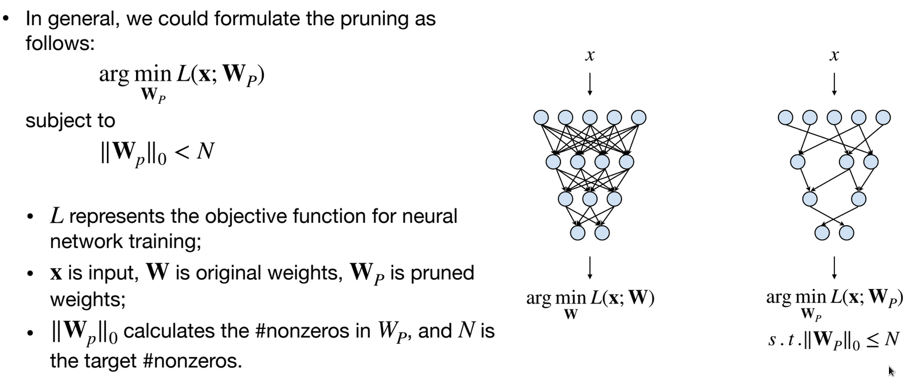

First Topic is ***neural network pruning***, Why ?

This summar of the topic was taken while studying the course EfficientML.ai course, for more details please refer to the course ([slide pruning I](https://www.dropbox.com/scl/fi/2oxmtvoeccyuw47yfambb/lec03.pdf?rlkey=3ykm0g21ibsoqn7xnw43v7aaw&e=1&dl=0))
- Memory is Expensive (Data Movement → More Memory Reference → More Energy)

We want to make the nn sparse, by pruning neurons, synapses.

We can finetune the remaining weights, to recover the lost accuracy.

1.Train connectivety → 2.Prune connections → 2.Retrain weights → Repeat from step 2, to push the prunned number of connections to the limit.

We should figure out the right treashold for pruning. 

****Determine the Pruning Granularity****

In what pattern should we prune the neural network?
  - Fine-grained/Unstructured
    - more flexible pruning index choice
    - but hard to accelerate because of the irregularity, parrallelism hates irregularity.
  - Coarse-grained/Structured
    - more regularity, easier to accelerate
    - but less flexible pruning index choice 
    - it's just a smaller matrix

Some examples :
- Pattern-based Pruning: N:M sparsity 
  - N:M sparsity means that in each contiguous M elements, N of them is pruned
  - A classic case is 2:4 sparsity (50% sparsity)
  - It is supported by NVIDIA’s Ampere GPU Architecture, which delivers up to 2x speed up
  - but we pay somwe overhead for storing the indices of the remaining weights, to have a matrix.
- Fine-grained Pruning
- Channel Pruning (we prune less compared to other methods), easy to accelerate, widely used in practice. 

We should do the trade of Latency-efficiency, Accuracy-efficiency, and Energy-efficiency. automatically select the pruning ratio.

****Determine the Pruning Criterion****
What synapses/neurons should we prune?

When removing parameters from a neural network model, 
- the less important the parameters being removed are, 
- the better the performance of pruned neural network is.

*Magnitude-based Pruning* (L1 norm)
- Remove the smallest weights
- It is simple and easy to implement
- There's other methods based on this like L2 norm, Lp norm, or doing a purning line wise, or column wise.

*Scaling-based Pruning* Pruning criterion for filter pruning, We can use it the batch normalization layer to know wich layer to prune.

A scaling factor is associated with each filter (i.e., output channel) in convolutional layers
- The scaling factor is multiplied to the output of that channel
- The scaling factors are trainable parameters
The filters/output channels with small scaling factor magnitude will be pruned

*Second-Order-based Pruning* (Hessian matrix difficult to compute)

When removing neurons from a neural network model, 
- the less useful the neurons being removed are,
- the better the performance of pruned neural network is.

*Selection of Neurons to Prune*
•Determine the Pruning Ratio 
•What should target sparsity be for each layer?
•Fine-tune/Train Pruned Neural Network 
•How should we improve performance of pruned models?