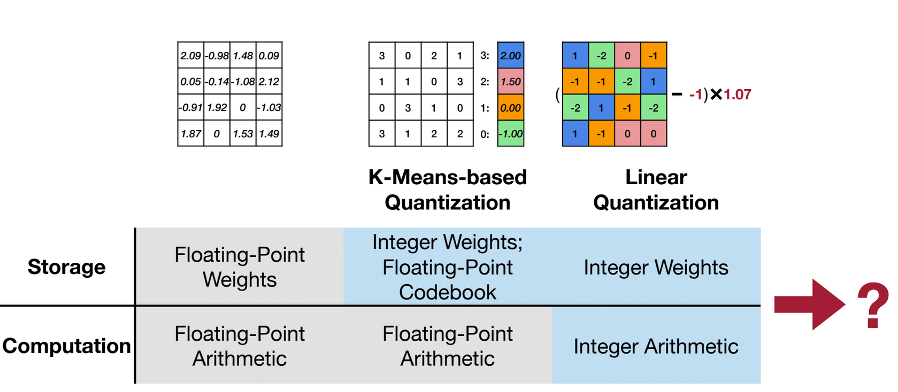
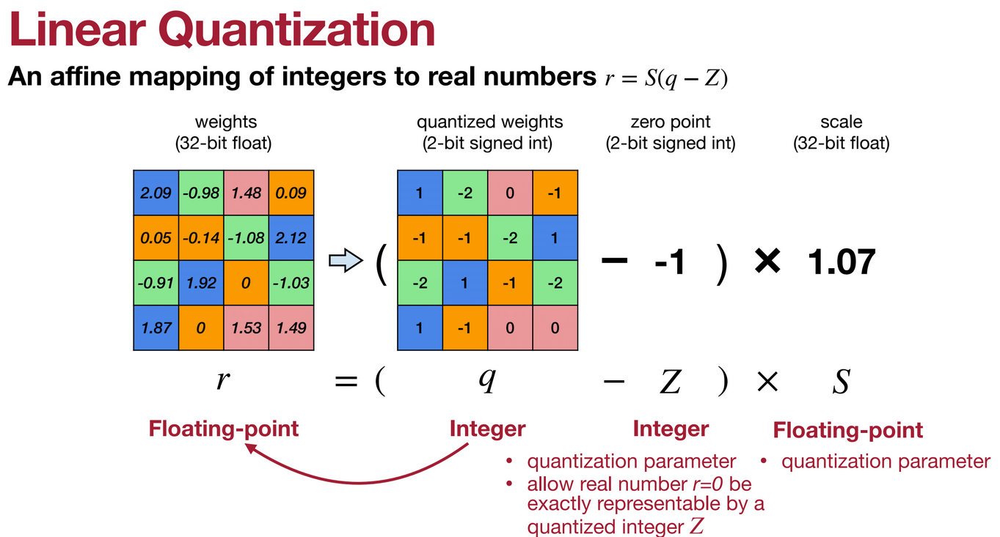

# Quantization

[slides](https://www.dropbox.com/scl/fi/eos92o2fgys6gk0gizogl/lec05.pdf?rlkey=2hohvi8jcvjw3f8m8vugfa2mz&e=1&dl=0), [slides II](https://www.dropbox.com/scl/fi/1mo0umu0qtq7uxap2l5m3/lec06.pdf?rlkey=bdl2mgusgajddjuvjxb0fot36&e=1&dl=0)

Low Bit-Width Operations are Cheap, Less Bit-Width → Less Energy

**Floating-Point numbers** : Exponent Widht -> Range, Mantissa Width -> Precision
    - IEEE 754 standard FP32, FP16 
    - Google Brain’s BFloat16 : 8-bit exponent, 7-bit mantissa
    - Nvidia FP8 (E4M3)
    - Nvidia FP8 (E5M2) for gradient in the backward.
  
**Quatization** is the process of constraining an input from a continuous or otherwise large set of values to a discrete set.

**Storage and Computation Efficiency**

