- Lecture slides : [part I](https://www.dropbox.com/scl/fi/lfcbzfbr3t2z9joz9ymt0/lec07.pdf?rlkey=yzx2o9bjnhzi5tstwevmcu6qv&e=2&dl=0), [part II](https://www.dropbox.com/scl/fi/hfstura3m6gf864jtxatz/lec08.pdf?rlkey=kafddvu496et6z01vgprm37px&e=1&dl=0)

# introduction to Neural Architecture Search

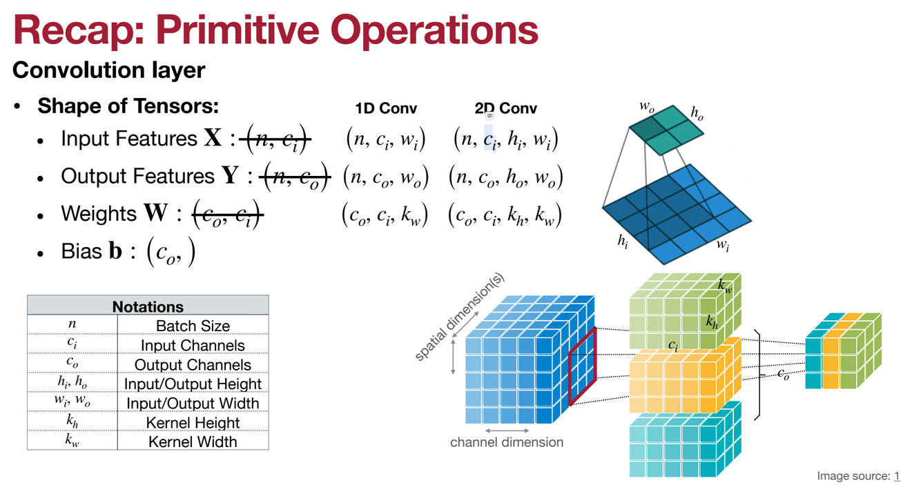
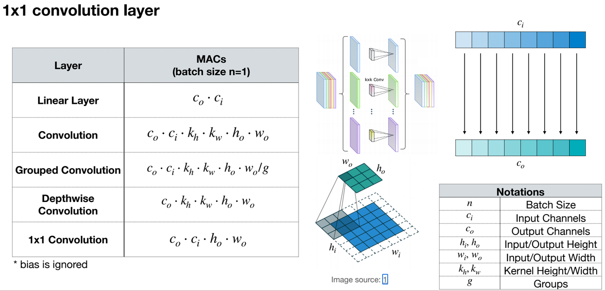

In ResNet50, bottkeneck block is used to reduce the number of parameters and computation. In this block, 1x1 convolutions are used to reduce the number of channels, then 3x3 convolutions are used to extract features, and finally 1x1 convolutions are used to increase the number of channels. The 3x3 is 9 times more expensive than 1x1 convolutions. REducing the channels before 3x3.

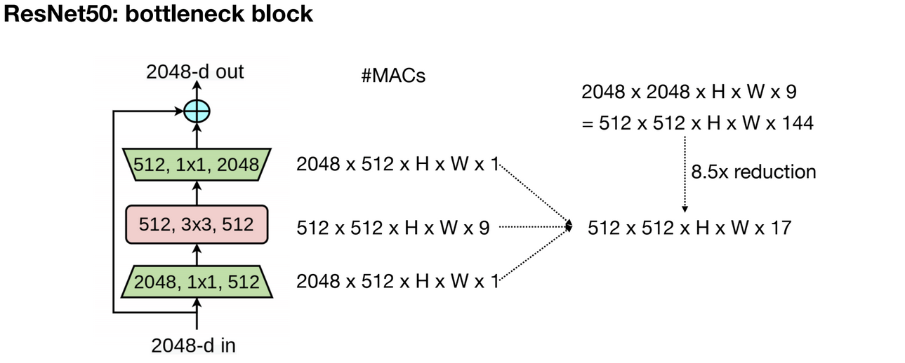

Then ResNeXt introduced grouped convolution, replace the 3x3 convolutions with 3x3 grouped convolutions, with 4 channels each, then concatenate the results and use the 1x1 convolutions. This is more efficient than the bottleneck block in ResNet50.

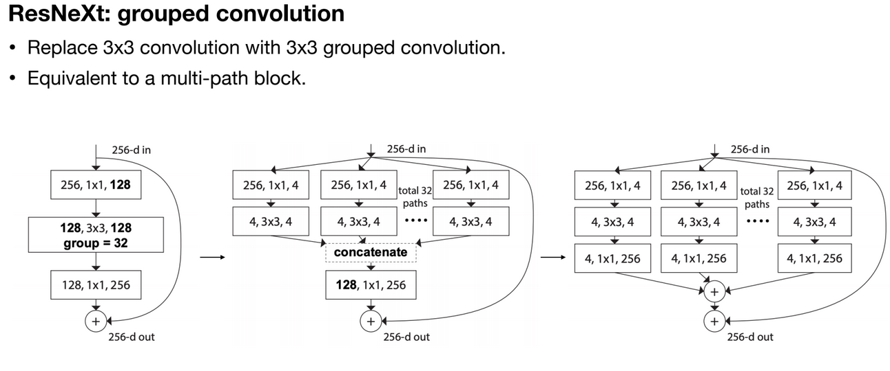

MobileNet: depthwise-separable block
- Depthwise convolution is an extreme case of group convolution where the group number equals the number of input channels.
- The 1x1 conv is used to mingule the info between the different channels.

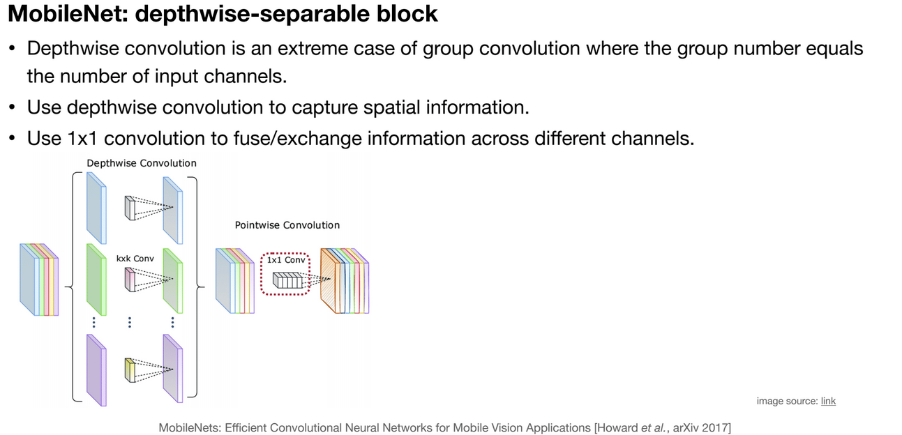

In NAS, the search space is the space of all possible neural network architectures. The search space is huge, so we need to use a search strategy to find the best architecture. The search strategy can be random search, grid search, evolutionary search, reinforcement learning, etc.

Search strategies:
  - Grid search
  - Random search
  - Reinforcement learning
  - Gradient descent
  - Evolutionary search

**Grid search**

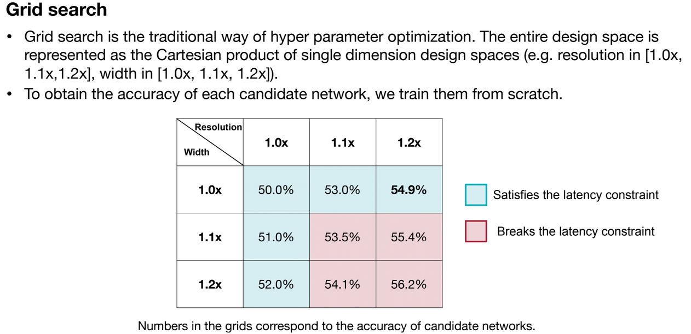
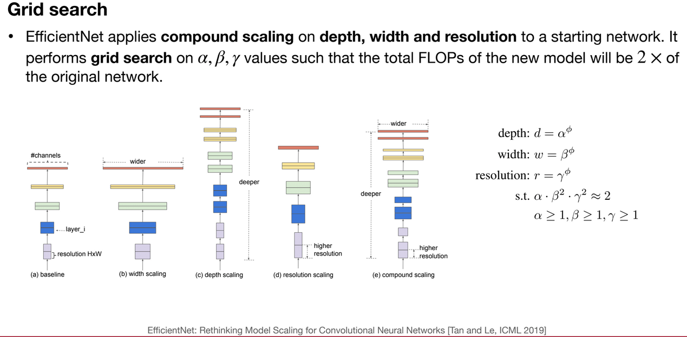

**Random search**
Random search is the simplest search strategy, but it is not efficient. It is like a blind search, instead of using the information from the previous searches, just randomly search the space.

**Reinforcement learning**
This is a more advanced search strategy. The agent is the neural network, the environment is the search space, and the action is the architecture. The agent takes an action, the environment gives a reward, and the agent updates its policy based on the reward. The agent learns to find the best architecture.

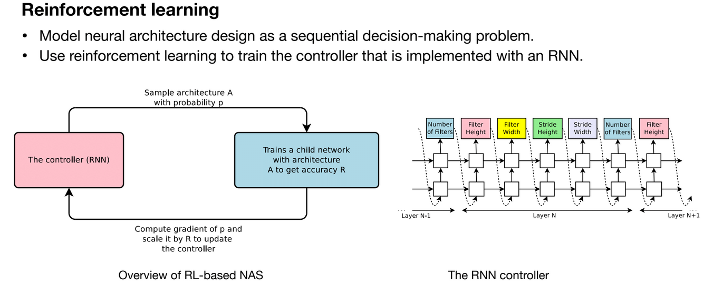

**Gradient descent**

This method is used to optimize the architecture. The architecture is represented as a vector, and the gradient of the loss function with respect to the architecture is calculated. Then the architecture is updated using the gradient descent algorithm. But we should keep all the gradients of all paths in memory, which is not practical. We can also add the latency of the architecture as a constraint to the loss function.

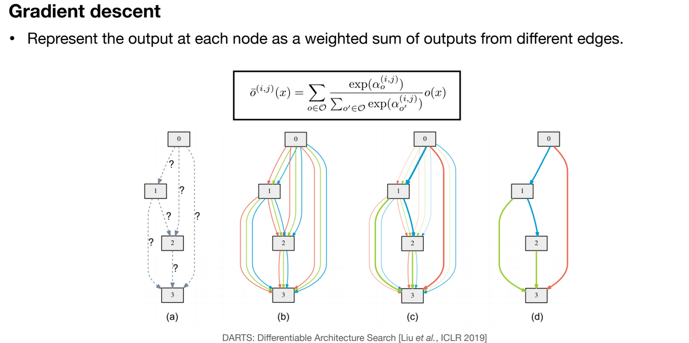

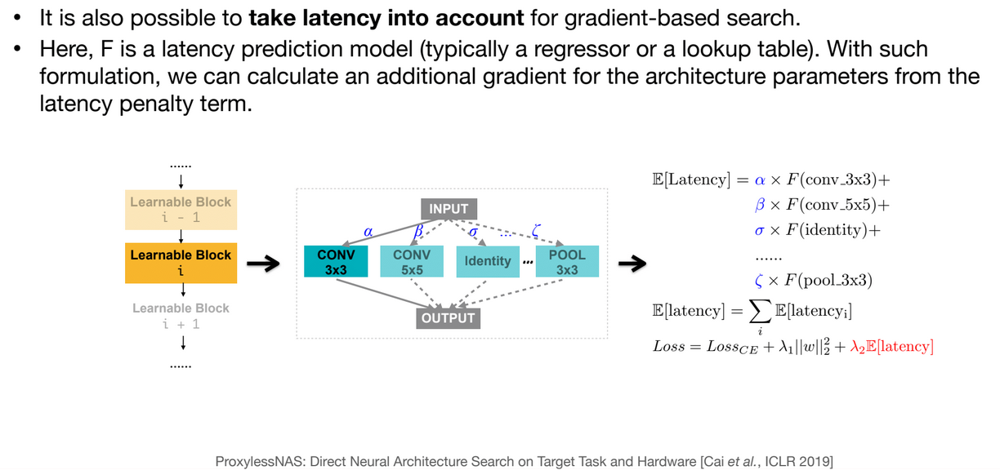

**Evolutionary search**

This method is inspired by the evolution of species.The neural networks are represented as genes, and the genes are mutated and crossed over to create new neural networks. The neural networks are evaluated based on their performance, and the best neural networks are selected to create the next generation. This method is more efficient than random search, but it is not as efficient as reinforcement learning.

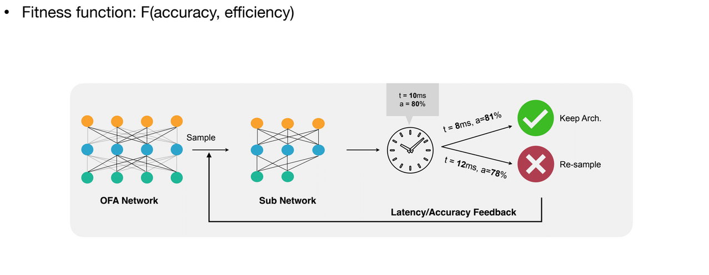
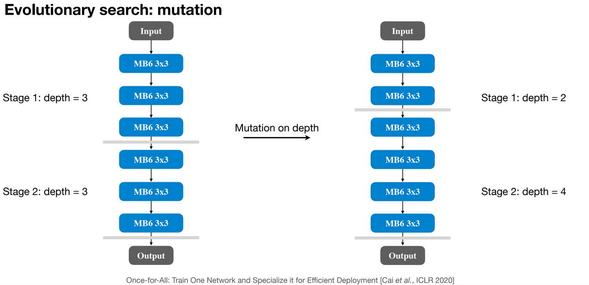
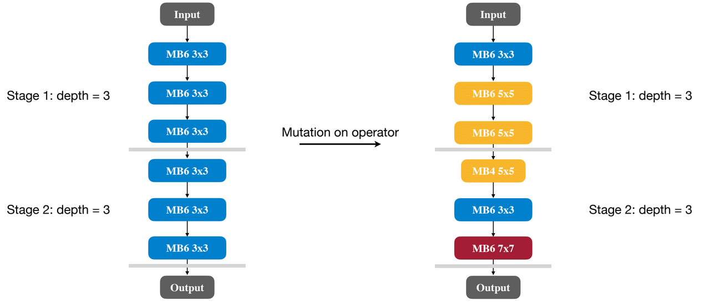

_crossover_

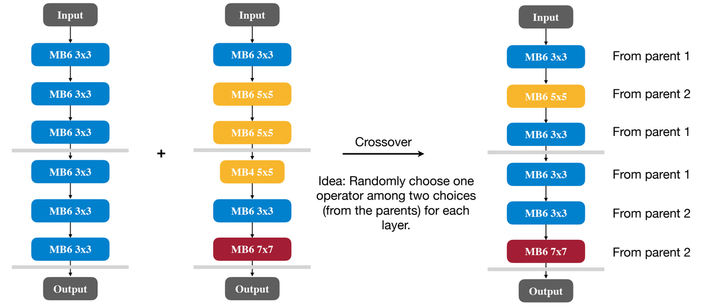

# Efficient and Hardware-aware NAS
**Accuracy estimation strategy**

In NAS, we need to estimate the accuracy of the neural networks to evaluate them.

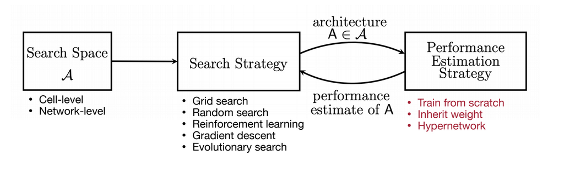

- _Train from scratch_ and observe the accuracy.
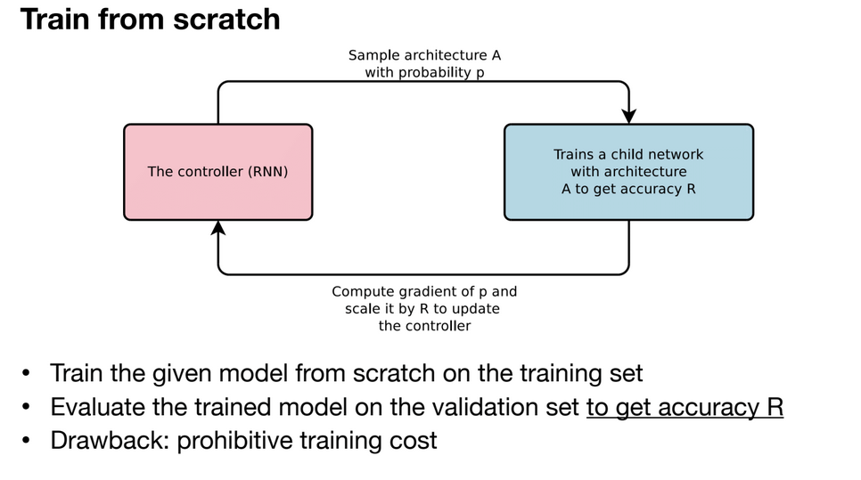

This method is slow and expensive, so we need to use a faster and cheaper method to estimate the accuracy.

_Inheret weight_

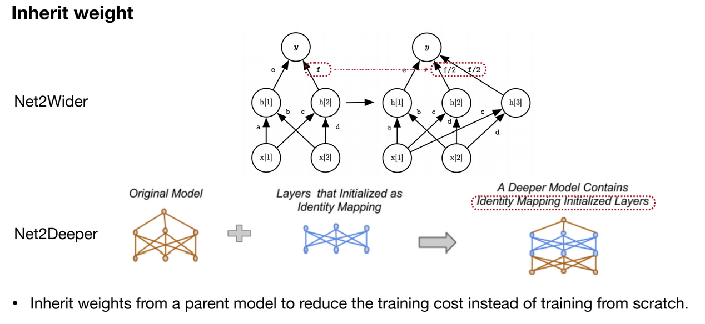

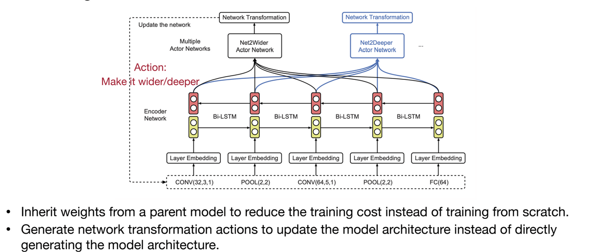

_hypernetwork_

hyypernetwork is a neural network that generates the weights of another neural network. The hypernetwork takes the architecture of the neural network as input and generates the weights of the neural network. The hypernetwork is trained to generate the weights of the neural network that maximizes the accuracy of the neural network.

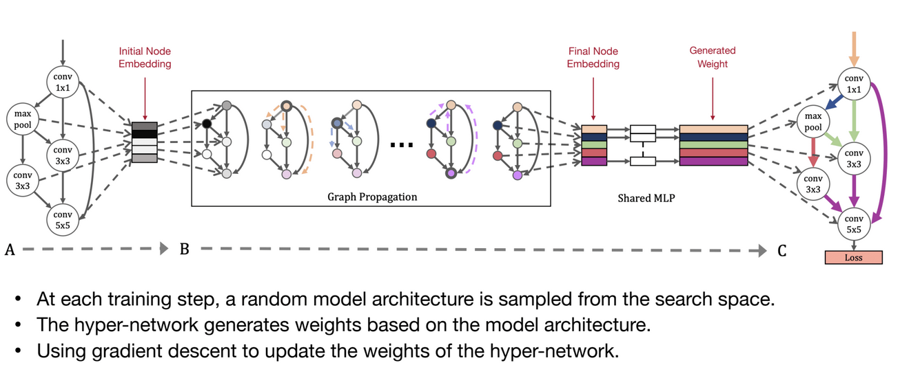

**Zero-shot NAS**
Estimate the accuracy without training it.

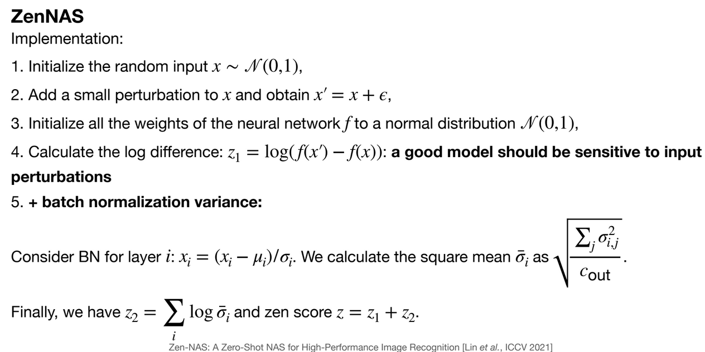

