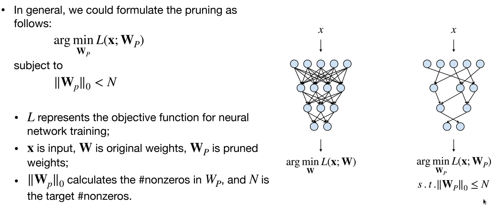
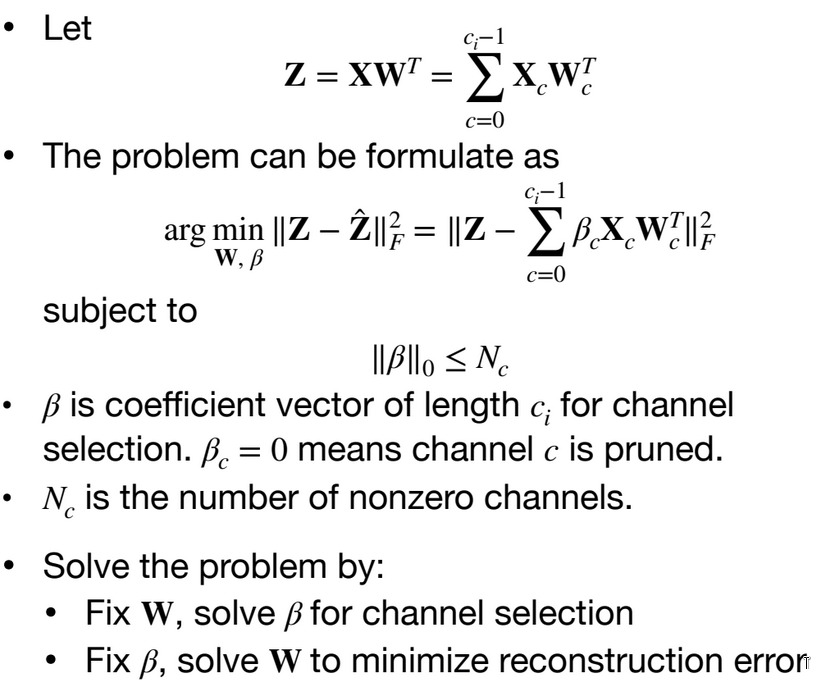

First Topic is ***neural network pruning***, Why ?

This summary of the topic was taken while studying the EfficientML.ai course. For more details please refer to the course, ([slides pruning I](https://www.dropbox.com/scl/fi/2oxmtvoeccyuw47yfambb/lec03.pdf?rlkey=3ykm0g21ibsoqn7xnw43v7aaw&e=1&dl=0), [slides pruning II](https://www.dropbox.com/scl/fi/oeh0e224uvqnftl00u9yy/lec04.pdf?rlkey=5yn44pfdrfjeqn6uq0k02bbdk&e=1&dl=0) )
- Memory is Expensive (Data Movement → More Memory Reference → More Energy)

We want to make the nn sparse, by pruning neurons, synapses.

We can finetune the remaining weights, to recover the lost accuracy.

1.Train connectivety → 2.Prune connections → 2.Retrain weights → Repeat from step 2, to push the prunned number of connections to the limit.

We should figure out the right treashold for pruning. 

****Determine the Pruning Granularity****

In what pattern should we prune the neural network?
  - Fine-grained/Unstructured
    - more flexible pruning index choice
    - but hard to accelerate because of the irregularity, parrallelism hates irregularity.
  - Coarse-grained/Structured
    - more regularity, easier to accelerate
    - but less flexible pruning index choice 
    - it's just a smaller matrix

Some examples :
- Pattern-based Pruning: N:M sparsity 
  - N:M sparsity means that in each contiguous M elements, N of them is pruned
  - A classic case is 2:4 sparsity (50% sparsity)
  - It is supported by NVIDIA’s Ampere GPU Architecture, which delivers up to 2x speed up
  - but we pay somwe overhead for storing the indices of the remaining weights, to have a matrix.
- Fine-grained Pruning
- Channel Pruning (we prune less compared to other methods), easy to accelerate, widely used in practice. 

We should do the trade of Latency-efficiency, Accuracy-efficiency, and Energy-efficiency. automatically select the pruning ratio.

****Determine the Pruning Criterion****
What synapses/neurons should we prune?

When removing parameters from a neural network model, 
- the less important the parameters being removed are, 
- the better the performance of pruned neural network is.

*Magnitude-based Pruning* (L1 norm)
- Remove the smallest weights
- It is simple and easy to implement
- There's other methods based on this like L2 norm, Lp norm, or doing a purning line wise, or column wise.

*Scaling-based Pruning* Pruning criterion for filter pruning, We can use it the batch normalization layer to know wich layer to prune.

A scaling factor is associated with each filter (i.e., output channel) in convolutional layers
- The scaling factor is multiplied to the output of that channel
- The scaling factors are trainable parameters
The filters/output channels with small scaling factor magnitude will be pruned

*Second-Order-based Pruning* (Hessian matrix difficult to compute)

*Selection of Neurons to Prune*

When removing neurons from a neural network model, 
- the less useful the neurons being removed are,
- the better the performance of pruned neural network is.

= All the weights associated with that neuron is removed (i.e, =0).

*Percentage-of-Zero-Based Pruning*
- ReLU activation will generate zeros in the output activation.
- Similar to magnitude of weights, the Average Percentage of Zero activations (APoZ) can be exploited to measure the importance of the neurons.
- The smaller APoZ is, the more importance the neuron has.

*Regression-based Pruning*

Minimize reconstruction error of the corresponding layer’s outputs : Instead of considering the pruning error of the objective function, regression-based pruning minimizes the reconstruction error of the corresponding layer’s outputs.

****Determine the Pruning Ratio****, What should target sparsity be for each layer?

Prune 30% of the weights, 50% of the weights, 70% of the weights, for each layer or what ?

Non-uniform pruning is better than uniform shrinking, because the network is not homogenous, some layers are more important than others.
Finding Pruning Ratios :
Analze the sensitivit of each layer:
- We need different pruning ratios for each layer since different layers have different sensitivity 
  - Some layers are more sensitive (e.g., first layer)
  - Some layers are more redundant
- We can perform sensitivity analysis to determine the per-layer pruning ratio
We take each layer Li and prune a small percentage of weights, and see how much the accuracy drops, and we do this for all layers. increasing the pruning ratio, we can see how much the accuracy drops, and we can see which layer is more sensitive to pruning. We should take into account not only the accuracy but also the size of the layer. Ww set a threshold for the accuracy drop, and we prune the layers that are below that threshold. (We will implement this in Lab1, please see the notebook for more details)

*Automatic Pruning* : 
- AutoML for Model Compression (AMC) [paper](https://arxiv.org/pdf/1802.03494):  To catacterize the relation between the comnputational cost (Number of operations) or Latency and the accuracy.

- NetAdapt: Platform-Aware Neural Network Adaptation for Mobile Applications [paper](https://arxiv.org/pdf/1804.03230)

****Finetuning Pruned Neural Networks****

- After pruning, the model may decrease, especially for larger pruning ratio.
- Fine-tuning the pruned neural networks will help recover the accuracy and push the pruning ratio higher.
- Learning rate for fine-tuning is usually 1/100 or 1/10 of the original learning rate

The Lottery Ticket Hypothesis: Finding Sparse, Trainable Neural Networks [paper](https://arxiv.org/pdf/1803.03635)

****System Support for Sparsity****

EIE: Efficient Inference Engine

### Summary :

**Pruning** is a technique used to reduce the size of a model by removing unnecessary or less important parameters (weights or connections). The main goal of pruning is to maintain or improve model performance while reducing computational costs and memory usage.

#### 1. **Why Prune?**
   - **Reduce Model Size**: Decreases the number of parameters, making the model more lightweight.
   - **Improve Efficiency**: Leads to faster inference and lower computational requirements.
   - **Lower Memory Usage**: Optimizes memory footprint, crucial for resource-constrained environments.
   - **Prevent Overfitting**: By removing less relevant weights, pruning can help improve the generalization of the model.

#### 2. **Types of Pruning**
   - **Magnitude-based Pruning**
   - **Structured Pruning**: Eliminates entire neurons, channels, or filters, making the network more efficient at a higher abstraction level.
   - **Unstructured Pruning**: Removes individual weights, but the structure of the network remains unchanged.
   - **Gradient-based Pruning**: Weights are pruned based on their gradients or sensitivity, ensuring minimal performance loss.
   - **Percentage-of-Zero-Based Pruning**
   
#### 3. **Pruning Process**
   - **Training**
   - **Pruning**
   - **Fine-tuning**: After pruning, the model is retrained (or fine-tuned) to recover any lost accuracy.

#### 4. **Post-Pruning Considerations**
   - **Performance Trade-off**: While pruning reduces model size and speeds up computation, it might degrade accuracy, so fine-tuning is essential.
   - **Sparsity**: Unstructured pruning can lead to sparse weight matrices, making hardware acceleration more challenging.

Pruning is often used in conjunction with other optimization techniques like quantization or knowledge distillation to further enhance model efficiency.