# Quantization

[slides](https://www.dropbox.com/scl/fi/eos92o2fgys6gk0gizogl/lec05.pdf?rlkey=2hohvi8jcvjw3f8m8vugfa2mz&e=1&dl=0), [slides II](https://www.dropbox.com/scl/fi/1mo0umu0qtq7uxap2l5m3/lec06.pdf?rlkey=bdl2mgusgajddjuvjxb0fot36&e=1&dl=0)

Floating point training -> PTQ -> QAT -> Inference, is the standard pipeline for quantization.

Low Bit-Width Operations are Cheap, Less Bit-Width → Less Energy

**Floating-Point numbers** : Exponent Widht -> Range, Mantissa Width -> Precision

- IEEE 754 standard FP32, FP16 
- Google Brain’s BFloat16 : 8-bit exponent, 7-bit mantissa
- Nvidia FP8 (E4M3)
- Nvidia FP8 (E5M2) for gradient in the backward.
  
**Quatization** is the process of constraining an input from a continuous or otherwise large set of values to a discrete set.

**Storage and Computation Efficiency**

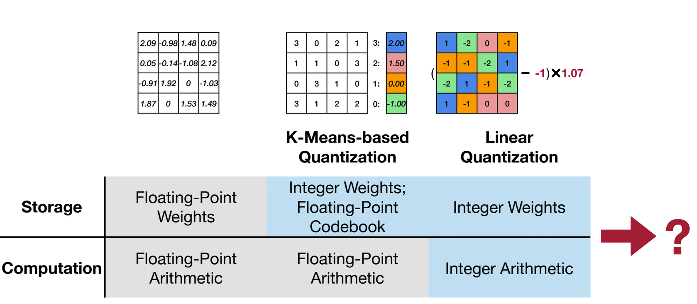

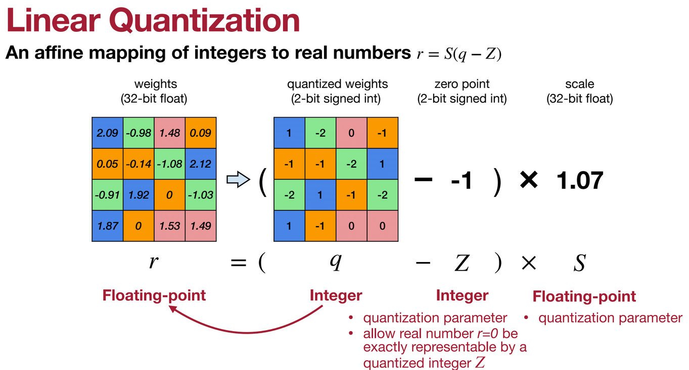

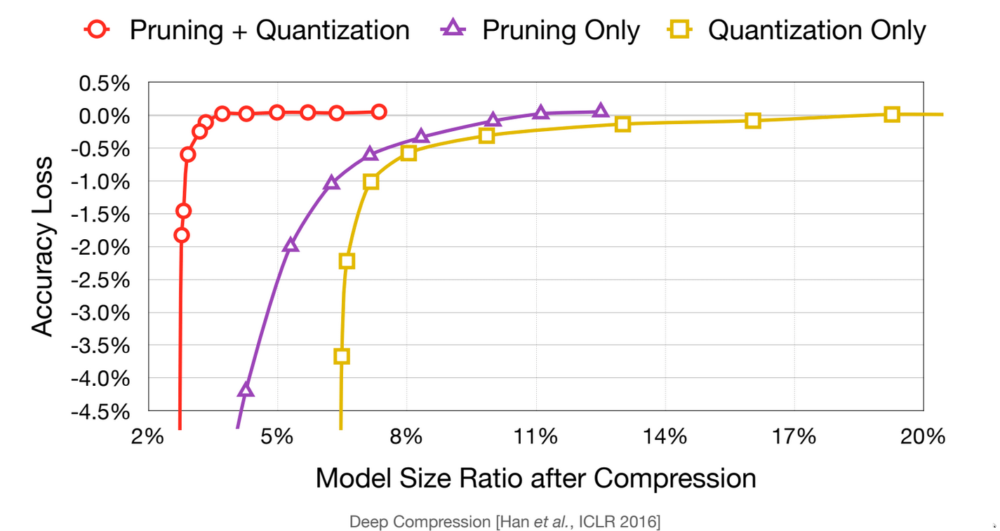

- Post-Traning Quantization
- Quantization-Aware Training
- binary and ternary quantization
- mixed precision quantization

### Post-Traning Quantization

#### Quantization Granularity
    - Per-Tensor 
    - Per-Channel
    - Group Quantization
      -  Per-Vector Quantization
      -  Shared Micro-exponent (MX) data type

  - Plot the range of the weights and activations, for each channel. We may have large differences between the channels -> per-channel quantization.
  
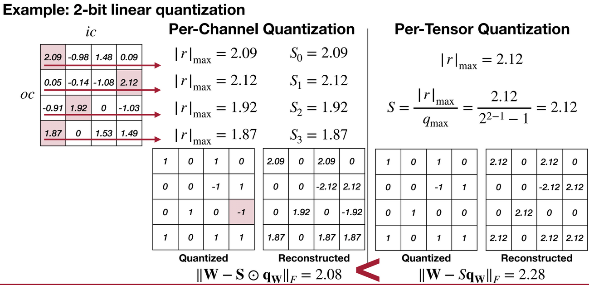

- Overhead : Not free lunch :), more storage use to store the Scaling factors.

To go to 4 bits, we need to go more fine-grained -> this gives us more flexibility to represent the weights and activations.
    VS- Quant: Per-vectore Scaled Quantization : 

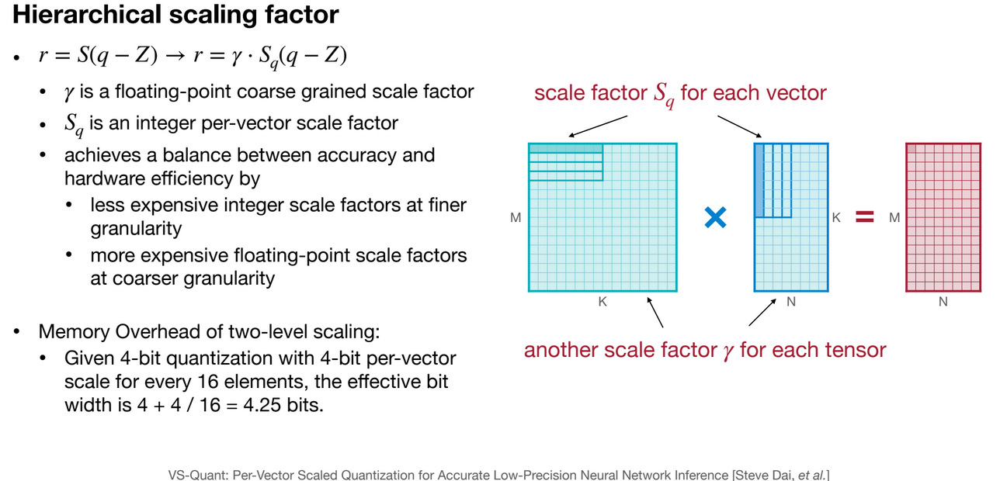

Group Quantization -> Multi-level scaling scheme.

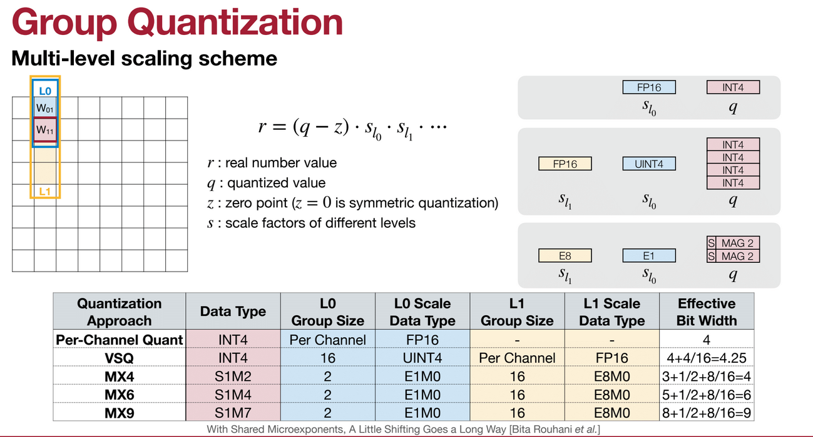

This is a very large design space, to explore if we can design our own data type that give a good trade-off between the hardware efficiency and the accuracy.

#### Linaer Quantization on Activations :

- weights are static, activations are dynamic. That's why we are more interested in quantizing the activations.

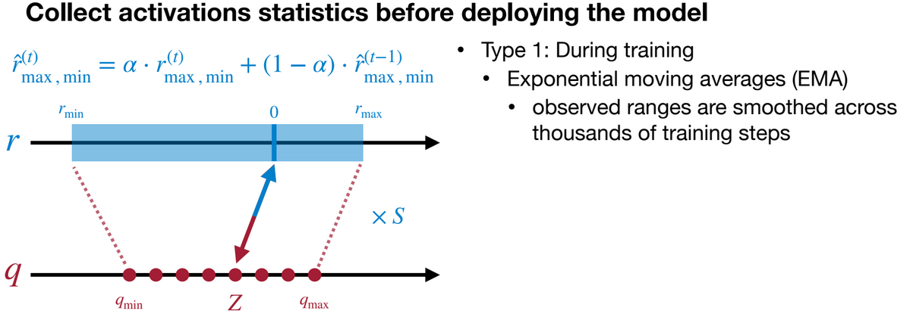

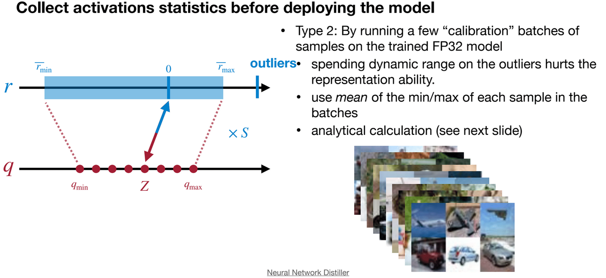

See : Quantization and Training of Neural Networks for Efficient Integer-Arithmetic-Only Inference [Jacob et al., CVPR 2018]

We can also Minimize mean-square-error (MSE) using Newton-Raphson method. see : Optimal Clipping and Magnitude-aware Differentiation for Improved Quantization-aware Training [Sakr et al., ICML 2022]

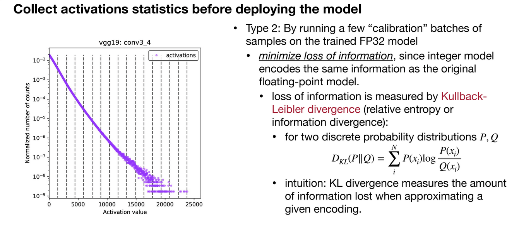

#### Rounding : 

- Rounding to the nearest integer is not optimal, because weights are correlated with each other. The best rounding for each weight (to nearest integer) is not the best rounding for the whole tensor.

- What is optimal? Rounding that reconstructs the original activationthe best, which may be very different
  -  For weight quantization only
  -  With short-term tuning, (almost) post-training quantization
  
See : Up or Down? Adaptive Rounding for Post-Training Quantization [Nagel et al., PMLR 2020]

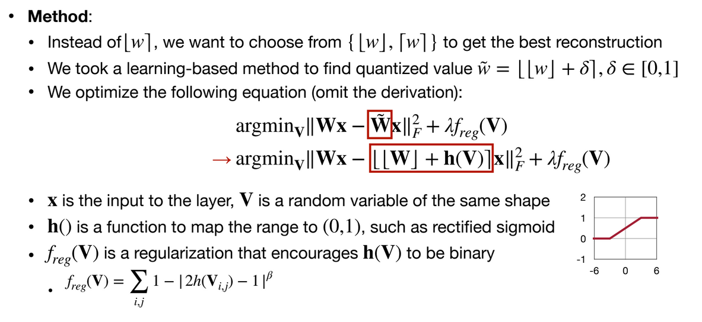

### Quantization-Aware Training

Train the model taking quantization into consideration, ( after training, we quantize the model, then fine-tune it).
- To minimize the loss of accuracy, especially aggressive quantization with 4 bits and lower bit width, neural network will be trained/fine-tuned with quantized weights and activations.
- Usually, fine-tuning a pre-trained floating point model provides better accuracy than training from scratch.

Let's suppose we have 1.2 as a weight, and we pass 1 to the network, if we get a gradient which is 0.1, we will add it to 1.2 instead of 1. This similates the quantization error in the forward pass, and puts it into the weights.

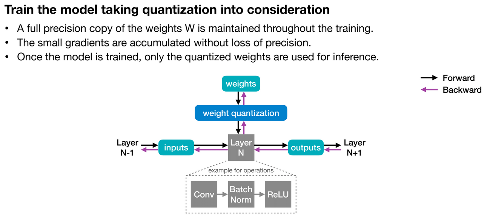

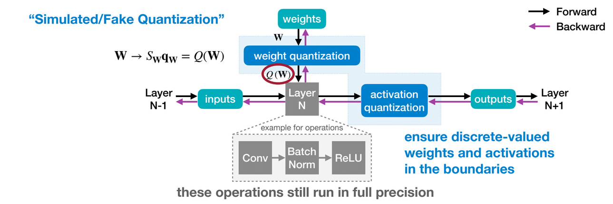

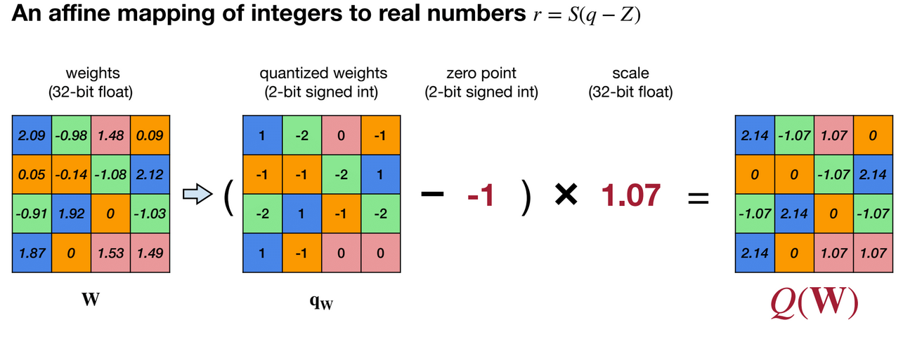

How should gradientsback-propagate through the (simulated) quantization?

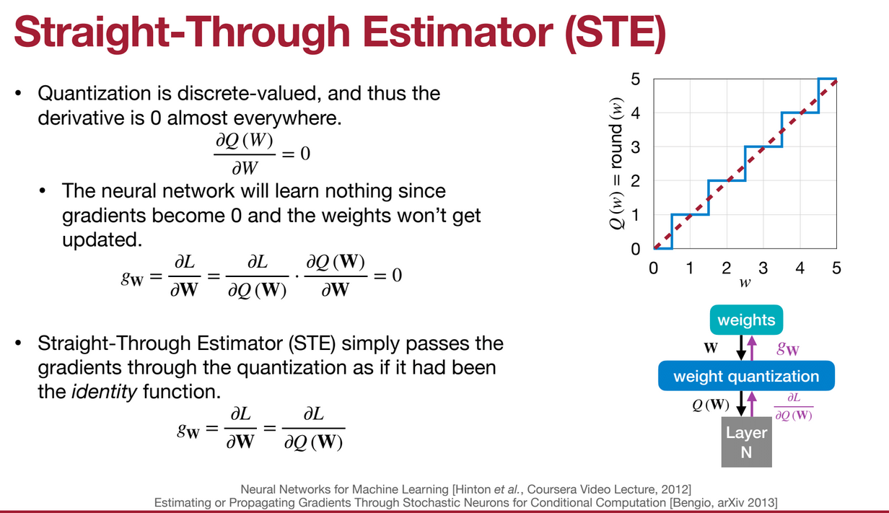

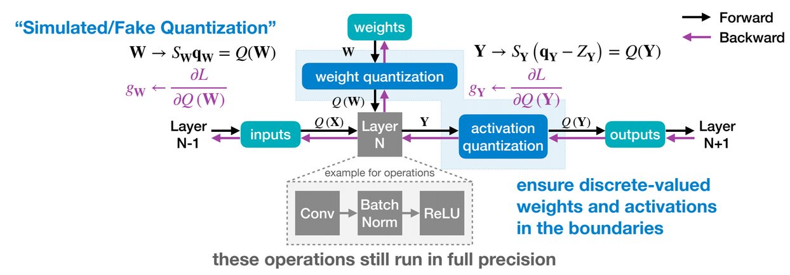

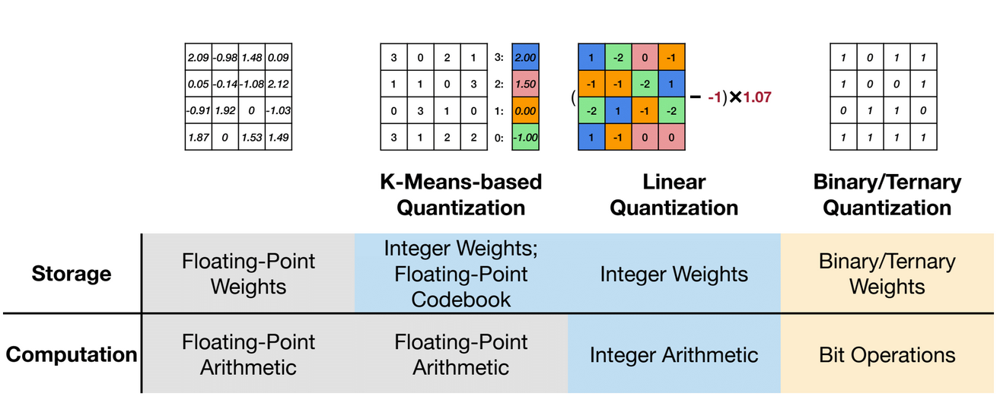

## Binary and Ternary Quantization

- Binary and ternary quantization are special cases of low-bit quantization.
- Binary quantization is the most extreme form of quantization, where the weights and activations are quantized to 1 or -1.
- Ternary quantization is a more relaxed form of quantization, where the weights and activations are quantized to 1, 0, or -1.
- Binary and ternary quantization are very efficient in terms of storage and computation, but they are very challenging to train.

## Mixed-Precision Quantization

- Allocate different bit-widths to different layers, based on the sensitivity of the layer to quantization.
- Challenge: Huge Design Space
- Solution: Design Automation : HAQ: Hardware-Aware Automated Quantization with Mixed Precision [Wang et al., CVPR 2019